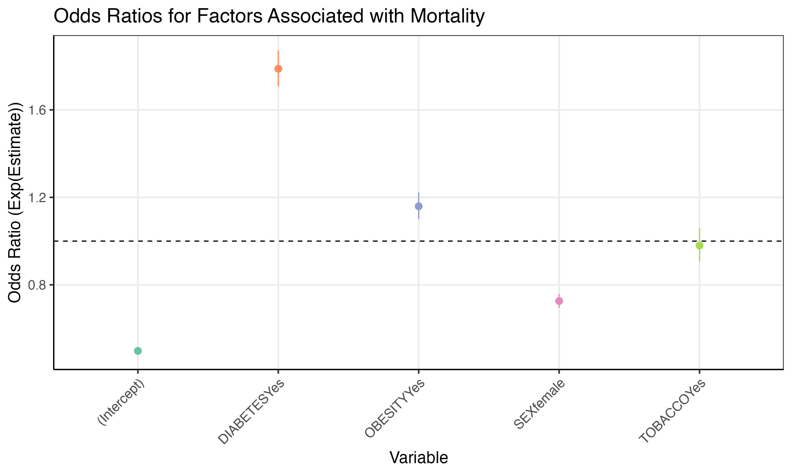
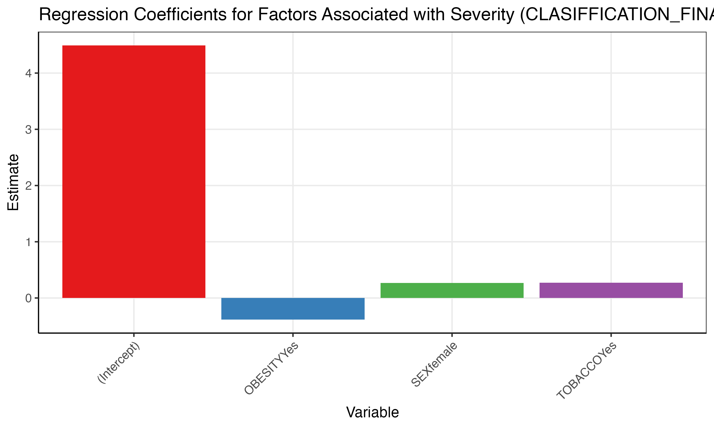
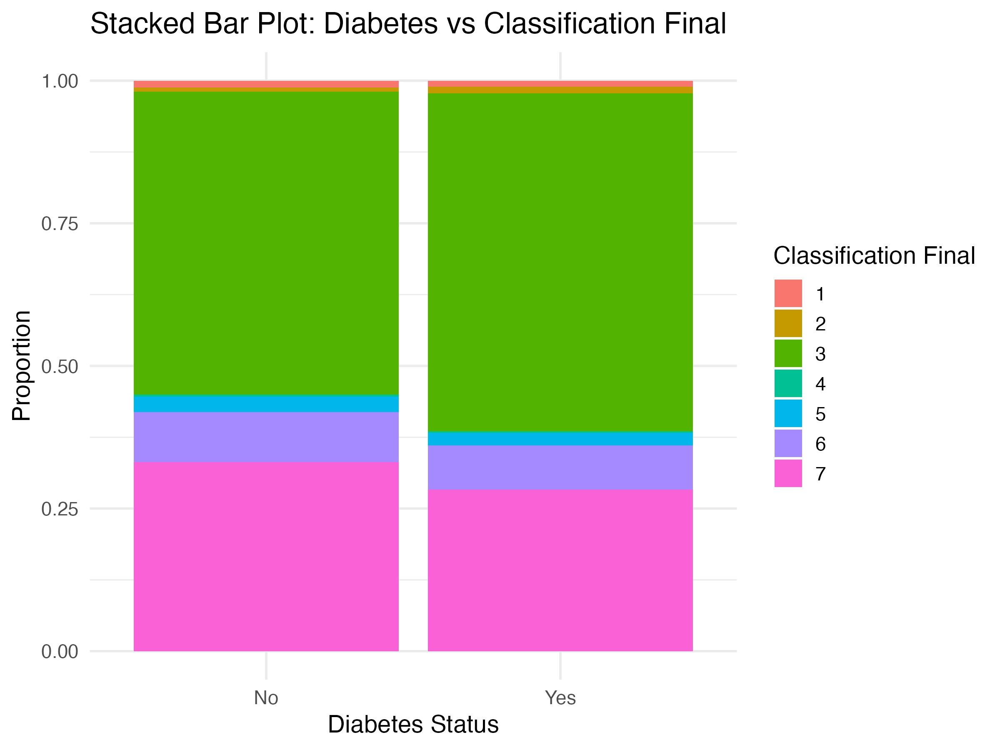

```{r read-config}
config_list <- config::get(
    config = Sys.getenv("WHICH_CONFIG")
)
covid_enabled <- config_list$covid
if (covid_enabled == T) {
  check_covid = "covid"
} else {
  check_covid = "non-covid"
  }
print(paste0("Now we are analyzing ",check_covid , " data."))
```

```{r, set-chunk-opts, echo = FALSE, message = FALSE}
pacman::p_load(
  knitr,
  tree
  )
opts_chunk$set(
  echo = FALSE, warning = FALSE, message = FALSE
)
here::i_am("code/covid_report.Rmd")
```

```{r, print-organization-structure, include = F}
# setwd("D:/Yan/Emory/2024Fall/DATA550/DATA550-Midterm")
# 
# print_tree <- function(path, prefix = "") {
#   # list all files and folders
#   items <- list.files(path, full.names = TRUE)
# 
#   # calculate the max name to alige
#   max_length <- max(nchar(basename(items)))
# 
#   for (i in seq_along(items)) {
#     # print
#     if (i == length(items)) {
#       cat(prefix, "└── ", sprintf("%-*s", max_length, basename(items[i])), "\n")  # last
#       new_prefix <- paste0(prefix, "    ")  # update prefix
#     } else {
#       cat(prefix, "├── ", sprintf("%-*s", max_length, basename(items[i])), "\n")  # other
#       new_prefix <- paste0(prefix, " │   ")  # update prefix
#     }
# 
#     # check if folder
#     if (file.info(items[i])$isdir) {
#       print_tree(items[i], new_prefix)  # recursive call
#     }
#   }
# }
# print_tree(".")
```

## 01_demography
```{r}

```


## Part II - Case Severity and Health Outcomes Analysis
```{r}

```


## 03_association
## 3.1. Multiple Regression Analysis: Diabetes, Smoking, Obesity vs Mortality

### 3.1.1Logistic Regression Results
```{r}
mortality_results <- read.csv("output/logit_mortality_results.csv")

knitr::kable(mortality_results, caption = "Logistic Regression Results for Mortality")

```
###3.1.2Odds Ratios for Mortality
```{r}
# Include the mortality odds ratio plot


```
##3.2. Diabetes and ICU Relationship
###3.2.1Chi-Square Test Results
```{r}
# Load Chi-Square test results
chi_results <- read.csv("output/diabetes_icu_results.csv")

# Display the Chi-Square test results in a table
knitr::kable(chi_results, caption = "Chi-Square Test for Diabetes and ICU Admission")

```
##3.3 Smoking, Obesity, and Severity Analysis
###3.3.1Linear Regression Results for Severity

```{r}
# Load severity regression results
severity_results <- read.csv("output/lm_severity_results.csv")

# Display the results in a table
knitr::kable(severity_results, caption = "Linear Regression Results for Disease Severity")

```
###3.3.2Regression Coefficients for Severity

```{r}
# Include the severity regression plot

```

##3.4Diabetes vs Classification Final
```{r}
# Include the diabetes vs classification final stacked bar plot


```

## 04_temporal_trend
```{r}

```

